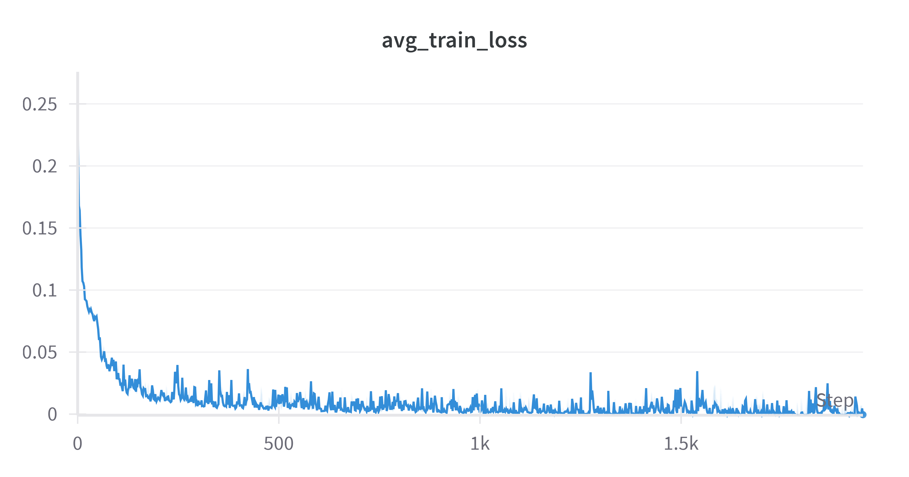
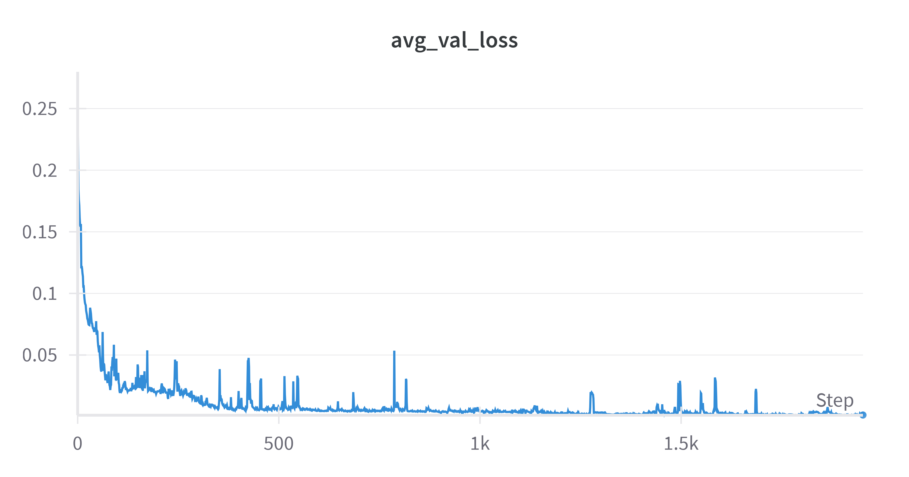

# Report

This is a concise report on the training, architecture, hyperparameter choices and learnings from training a UNet on Polygon Images and Color strings to output an Image of the same Polygon filled with the given Color.

---

## Architecture
Classic **UNet** architecture with a small modification. We use the **embedded color vector (embedding dimensions = ```3```)** and expand it to **```(128 X 128)``` dimensions**, making a **```(3 X 128 X 128)``` tensor**, which is concatenated at the start of the ***UNet*** and at the **end of the bottlenack layer.** ***(resized using bilinear interpolation where ever necessary).***

### Encoder:
- 3 Layers, with depths **```32, 64, 128```.**
- Each **Convolution layer** has **kernel size ```3```.**
- Each **Downsampling layer** is **Max Pooling** with **kernel size ```2```** and **stride ```2```.**

### BottleNeck:
- Same as the Convolutional layer of the Encoder, **adjusted accordingly for the addition of color map. Hence, has a depth of ```253```.**

### Decoder:
- 3 Layers, with depths **```32, 64, 128```.**
- Each **Convolution layer** has **kernel size ```3```.**
- Each **Upsampling layer** is **Transposed Convolution** with **kernel size ```2```** and **stride ```2```.**

### Color Embedding:
- We form a mapping between **colors present in our dataset** and **positive integers.**
- These positive integers represent each color, and we use **embedding or look up** for each of these integers. The embeddings are **3 Dimensional**, where the idea is that this 3 Dimensional embedding be a **quasi-representative of the RGB values of a color.**

## Dataset preprocessing and augmentation

- I extracted color information from the data using simple code shown in ```dataset_process.py```
```
#creating a set of all colors
colors = set()
for image in os.listdir(outputs_path):
    color = image.split('_')[0]
    colors.add(color)

#assigning a positive integer to each color
encoded_color = {color:i for color, i in zip(list(colors), range(len(colors)))}

#saving it as a .json file
if __name__=='__main__':
	#saving a mapping between colors and their corresponding numerical representation as a dict
	filename = 'encoded_color_dict.json'
	with open(filename, 'w') as f:
	    json.dump(encoded_color, f, indent=4)
  ```

  - I load the data using **Pytorch's Dataset class.** 

  - Coming to data augmentation, it has been **coded inside the** ```PolygonDataset``` **class itself**. I perform, with probability ```0.5```, on **both Input image (polygon) and Target image (polygon filled with color)**
    1) Rotation by a random angle ```theta```
    2) Horizontal Flip
    3) Vertical Flip

## Training

Not many issues faced except for minor bugs and errors in code. No major failure modes encountered.

### Loss functions
We use two loss functions

1) ```MSE Loss```: Mean Squared Error between the pixels of the predicted and target images. Used for exact pixel to pixel matching
2) ```SSIM Loss```: Structural Similarity Index Score measures how similar two images are based on features like luminosity etc. This loss was used for generalizing the output and driving it to look similar to the output images and not predicting something wildly off.

### Average validation loss and training loss curves





As you can see, by 2000 epochs, the loss is almost close to ```1e-3``` to ```5e-4```, which is, not the best, but good enough.

## Hyperparameters

Out of all the hyperparameters, the ones that affected the performance the most were the **Model Hyperparameters**.

### Initial Model parameters:
- Initially, I tried a shallow UNet with depths of 8 and 16. This did work to some extent but was useful only for **memorization of the given dataset**.

- Later, I aggresively increased the **depth of the UNet and also the underlying CNN depth** to a notch below the ones mentioned in ***Architecture***. 

- An interesting observation was, **this new, deeper model perfectly learnt the dataset given** but was **not able to learn on augmented data.**

- That was solved by adding in **some more layers and Batch Normalization**

### Training Loop Hyperparameters
- **Epochs:** 2000

As the number of training samples are very less, we need high number of epochs. Also, training for longer than that usually makes the model unstable in my observation, especially when batch size is less.

- **Learning rate**: 0.001

No particular reason, it worked just fine.

- **weight_decay**: 0.00001

No particular reason, it is the standard value and worked just fine.

## Remarks

The effect of regularization techniques like Batch Normalization, SSIM loss and weight decay on the generalization power is immense. With no regularization, my outputs were all wild and over the place, but using regularization techniques, my outputs kind of smoothened out. 

This was something I obviously knew from my course, but no one taught me how it even smoothens the outputs and reduces irregularities in the outputs.

